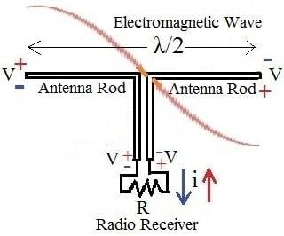
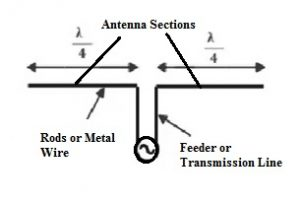
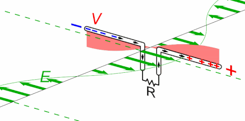
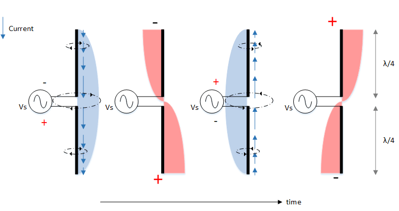
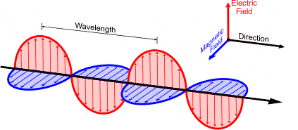
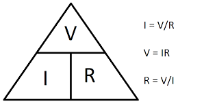
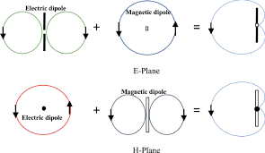
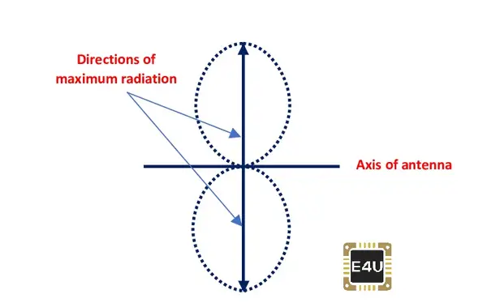
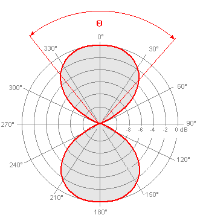
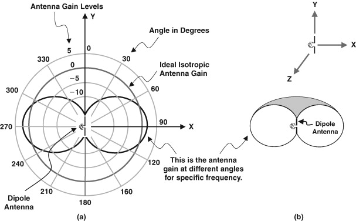

# Chapter 2: The Half-Wave Dipole Antenna in Free Space

### What is *free space*?

An antenna in free space is an extreme case where your antenna is considered the only object in the universe. This is a good way to think of antennas because it helps focus on just the functionality of the antenna vs the impact of the environment.

## The Half-Wave Dipole

The half-wave dipole is an antenna with 2 poles that are each λ/4 long (1/4 wavelength), meaning the total length of the antenna is λ/2, a "half-wave".

As with other antennas - a dipole antenna requires alternating current.

Many other antennas are made up of combinations of λ/2 dipole antennas in various configurations.

The figure above shows the layout of a λ/2 dipole antenna. The circle in the center represents a generator that is generating a signal at the operating frequency *f*. The total length of the conductor from end-to-end is approximately λ/2.

The distance of one wavelength in free space is the speed of light (*c*) multiplied by the time it takes to make a complete cycle. The time for one cycle is the waveforms **period** or 1/*f*. Thus, a wavelength in free space is given by the following formula: **λ = c/f**

For example, if c is in meters per second, and f is in Hertz (cycles per second), then λ will be in meters. To demonstrate with numbers, if you have a frequency of 10MHz, you have λ = 300,000,000 m/s divided by 10,000,000 Hz, which means λ = 30 meters. When using MHz, it may be convenient to just set c to 300, and totally cancel out the six zeroes for the million in c and MHz.

## So how does a dipole work?

https://en.wikipedia.org/wiki/Dipole_antenna

A key to understanding a dipole is looking at the "boundaries" or end points, where some conditions exert themselves. Physicists call these *boundary conditions* because they occur at the boundary between regions. In a dipole, the boundary exists between the conducting wire and the free space at each end of the dipole.

The condition is that there can be no current flow at the end of a conductor, because there is nowhere for the current to go. If there is power being supplied to this conductor, then λ/4 back from where the current is 0, the current must be at its maximum, as seen represented by the blue in the diagram above.

In conjunction with the current, if there is no current at the end of the antenna then the voltage must be at it's maximum. Inversely, the minimum voltage will be found closest to the generator. This can be seen in the graphic above as the red components of the diagram.

The power the generator puts into the antenna will be transformed from an electrical signal into a radiated electromagnetic wave.

The antenna power will be the current at the center multiplied by the voltage at the center, which is the current and voltage supplied by the generator. Ohm's law, as with any other circuit, defines this relationship.

Note that the feed point of the dipole is just an electrical circuit, with connections going to the antenna from the generator. In *free space*, you find that the voltage at that point is 73 times the current. Thus, the generator sees a load that looks like a resistor of 73 Ohms = V/I

## Where does the power go?

The amount of power that the generator delivers is the same it would deliver into a resistor with a resistance of 73 Ohms. The generator can be designed to deliver power to a 73 Ohm resistor, and that power (less any losses) will be transformed into a radiated field by the changing currents flowing on the dipole. This resistance is called *radiation resistance*.

The radiating field leaves the dipole in a three dimensional fashion difficult to describe in words. Outgoing electrical and magnetic fields created by the antenna are perpendicular to eachother.

With the above visual, we can see that the magnetic and electric fields will be perpendicular to eachother. I don't at this stage know what E plane or H plane is.

Each field is also perpendicular to the direction in which a wave travels away from the antenna. The overall field strength in any direction is proportional to the magnitudes of the two field components. This results in a radiating field that leaves with maximum strength in a direction perpendicular to the wire making up the dipole. The field strength is reduced as you move around the dipole to the direction of the ends, where there are neither electric nor magnetic field lines. This can be seen in the visual below.

## Antenna Analysis Tools

There is a lot of math calculating the strength of antennas, but there are computer modeling tools to limit the difficulty. One tool is called *EZNEC*, available at www.eznec.com.

## Polar Plots

A common way to show information about power in a particular direction is a *polar plot*. This kind of plot represents the intensit in a particular direction by the length of a line, at any angle from the center. A polar plot of a dipole can be seen below:

In the polar plot, we can see the outer rings as stronger signals (increasing dB), and the degrees showingthe directions. In this case, the bipole antenna would be aligned along the 270* to 90* line.

## Which Way is Up?

An antenna in *free space* is interesting because you don't need to consider the interactions between the antenna and anything else around it.

### Polarization

A dipole antenna could be oriented against the Earth in many ways, but the most common are the "extreme" cases where it is either parallel or perpendicular to the Earth's surface.

If the dipole is oriented parallel to the Earth, the electric field would also be parallel to the Earth. The antenna and electric field would both appear horizontal, so this antenna is said to be *horizontally polarized*. If the dipole is perpendicular to the Earth, it is referred to as *vertically polarized*. 

The polarization of an antenna is important for many reasons, including:
- Antennas that are horizontally polarized will not receive any signal from vertically polarized wavefronts, and vice-versa.
- Antennas that are horizontally polarized have performance characteristics very different than vertically polarized when both are near the ground.

Any antenna which is oriented somewhere between horizontal and vertical is said to have a *skew polarization*. It can be considered a part of both horizontal and vertical, with the power associated with which depending on the tilt.

It is also possible to have an antenna that generates a waveform that shifts in polarization as it leaves the antenna, continually changing in space. This is called circular polarization.

## Review Questions

### 2.1: Describe circumstances for which a "free space" dipole model can represent a real antenna

A free space dipole model can approach an accurate representation of a real antenna when that real antenna is further isolated from objects that could interfere with its signal.

### 2.2: Calculate the approximate length of λ/2 dipoles for 0.1, 1, 10, 100, and 1000 MHz

Formula: λ = c / hz

- 0.1: 300,000,000 / 100,000 = 3000m (3km) λ, so one part of the dipole (λ/4) would be 750m
- 1: 300 / 1 = 300m -> λ/4 = 75m
- 10: 300 / 10 = 30m -> λ/4 = 7.5m
- 100: 300 / 100 = 3m -> λ/4 = 0.75m (75cm)
- 1000: 300 / 1000 (1GHz) = 0.3m -> λ/4 = 0.075m (7.5cm) 

### 2.3: Discuss applications for which a horizontally polarized dipole might be most appropriate. Repeat for vertical polarization.

~~A horizontally polarized dipole would likely be the most appropriate for cases where you are trying to communicate with something extraterrestrial. For example, trying to connect to a satellite in orbit, or even a spacecraft further out in space, or on another planet (like the Mars rovers).~~ 

Horizontal polarization is often used in HF long distance communications, it reduces ground losses and is common in amateur radio and broadcast systems. 

Horizontal has lower ground losses due to reduced ground currents. Horizontal antennas are better able to utilize the ionosphere to bounce signals for skywave propagation. For directional antennas, it is standard to use horizontal polarization (can be seen with things like Yagi arrays, think old TV antennas).

Vertical polarization is often used in mobile communications, used in VHF/UHF ground communications. Works well with ground reflection propagation. I can think of seeing the perpendicular antenna on cell towers, or think about SINCGARS/ASIP whip antennas.

Ground wave propagation with vertical polarization causes the signal to follow the Earth's surface better. Vertical also produces a 360* horizontal radiation pattern, making it hit a wider area.
### 2.4: Consider an amplifier with 20dB of gain, matching networks at input and output each with a loss of 1dB and an antenna with a gain of 5 dB. What is the total system gain? (See appendix B if needed)

How to calculate dBm: 10log10(P/1W) where P is the power in Watts

20dB gain, - 1dB input - 1dB output + 5dB antenna = 23dB total gain

### 2.5: If an input signal of 0 dBm is applied to that system, what is the output radiated power in dBm, mW?

dBm is just absolute power, acting as if it has power to convert to Watts. We can take the above and say it is 23dBm, and convert that back to mW:

PmW = 10PdBm/10

P = 1023/10

P = 102.3

P = 199.5262...

So the output radiated would be measured as 199.53mW