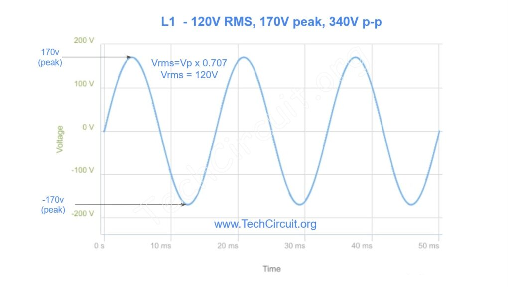
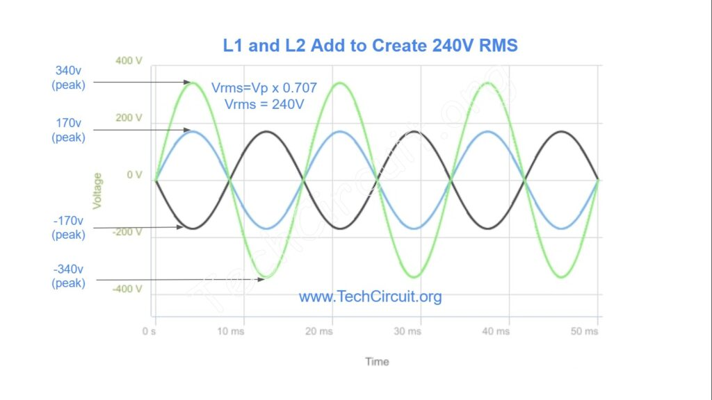
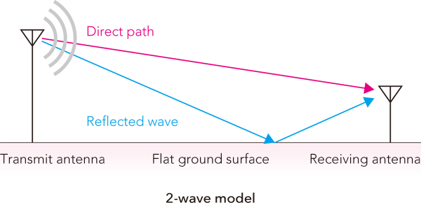
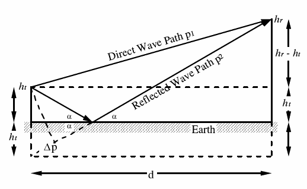
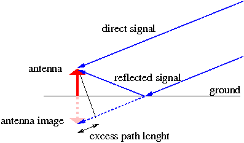
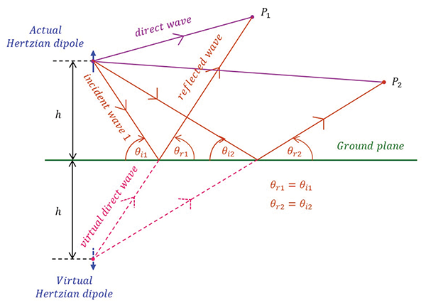

# The Field From a Dipole Near the Earth

## Phase of an Electromagnetic Wave

When talking about a circuit such as a standard household 120V, it's important to recognize that 120V is the root-means-square (RMS) or effective value of the sine wave. The actual voltage varies with time at a frequency of 60Hz, as seen below.

If you measure the voltage at various times, you will measure an instantaneous voltage of anywhere between -170V and +170V. If you combine two such signals in a circuit that added the voltages, the result could range between -340V and +340V. If you add up two signals of the same phase, you end up with twice the voltage.

In the other extreme, we could see one signal at it's maximum positive while the other is at its maximum negative voltage. In this case, the resulting net voltage would add up to 0V, as the signals would cancel eachother out. This would be known as a signal being exactly out of phase with the original signal.

Electromagnetic waves travel from an origin to a destination through multiple paths, especially through the ionosphere, and as a result exhibit all sorts of variations. Depending on the relative phase of the signals at the reception point, they could add, or could subtract from eachother. This is known as fading or signal enhancement (depending on if it helps or hurts the signal).

## What is the Effect of Ground Reflections?

A signal transmitted in any direction from an antenna near the Earth will have a direct path, and it will also have a path that results from the reflection from the surface of the Earth.

In the above, you can see that the direct path is shorter and wil first hit the receiving antenna, and then the reflected wave will hit shortly afterwards. 

In the above, we can see the example with an antenna elevated above the Earth broadcasting to a target in space.

For any elevation or takeoff angle there is a direct path from the antenna to the observer, and there is also a reflected path. The two paths have different lengths, with the reflected paht always longer than the direct path. The difference in length will depend how high above the Earth the antenna is and the elevation angle. 

As the downward wave strikes the Earth, the combination of the incident wave and reflected wave cannot create an electric field at the surface of the ground since fields can't exist in a perfectly conducting ground medium (they are shorted out by the ground). Therefore, for a horizontally polarized antenna the reflected wave must be out of phase with the incident wave.

Vertically polarized waves must have the reflected and incident waves in phase with eachother because opposite ends of the field are at the Earth's surface when they are in phase.

You can calculate the difference in path length fairly easily using plane geometry and trig, provided any takeoff angle and height. By combining this with a known signal frequency and speed of propagation (speed of light in air), you could easily compute the phase difference due to the different path and thus resultant amplitude. You can also use antenna modeling tools for the same.

Another way to visualize the reflected wave is to imagine it comes from another antenna under the Earth the same distance that the real antenna is above the Earth. This is called an image antenna and isn't real, but the path length difference is easier to visualize and calculate.

### How do the numbers add up?

Knowing the phase of the reflected wave and the height of the antenna, you can thus determine the resultant phase of the direct and reflected signals as a function of height. This just means you need to know the difference in path length in terms of wave lengths. For example, if the polarization is vertical, and the difference in path length is an odd multiple of a half wavelength, the signals will be out of phase and cancel at that angle. At other elevation angles, the difference may be an even number of half wavelengths and the signals will be the same phase and add together. For horizontally polarized antennas, it is the inverse. Intermediate (skewed) angles will have values in between the extremes.

You can determine the intensity of the combination of the two antennas by merely adding up the signals for each elevation and azimuth angle. You can also use tools such as EZNEC for this.

### Dipole over typical ground

The elevation pattern of an antenna near the Earth is quite different from one far removed from the Earth. This is due to the reflections from the Earth. For a horizontal antenna at the 1/2 wavelength above ground the reflection will be out of phase to start with. So 1/2 wavelength off ground gives a phase reversal at the reflection, and one more 1/2 wavelength up towards the antenna results in an out-of-phase signal that cancels the upward going wave. Note that the wave along the horizon cancels with the out of phase reflected wave, resulting in no radiation at 0* elevation.

### Where does the power go?

The areas with the most signal have a significantly stronger signal than they had in the free-space case because the other areas have a significantly weaker signal. This effect is referred to as *ground reflection gain* (I need to google some youtube videos of this...). It isn't a real gain, like from an amplifier, but more of a redistribution. On the other hand, if you want the signal to go where the signal combined with it's ground reflection goes, it seems just like an amplifier to a distance receiver. 

By tending to cancel the upward and horizontal signals, the maximum signal in the main beam (coming perpendicular from the antenna) is about 5.5dB stronger than the free-space case. This is an advantage if that is the direction you want the signal to go.

### What about a better ground?

Perfect ground is hard to come by (they used an example of a ground with flat gold foil), but saltwater is a close approximation. It is also possible to use a large expanse of bonded wire mesh or similar structures to similar almost perfect ground.

### What happens at different heights?

The elevation pattern of a horizontal antenna is very dependent upon the height above ground. If the antenna is much lower than λ/2, a horizontal antenna will not have the upward direction energy cancelled, with the result that most of the energy heads upward. For example, a λ/4 high dipole has a strong signal directly up (good diagram on page 3-5, figure 3-8). Low antennas can work well for medium distance communications.

As the height over ground increases, the patterns for horizontally polarized antennas tend to get more complex, and you get an increased number of elevation angles with nulls. As the antenna height increases, the first radiation peak moves down to lower angles and each peak covers a narrow range of elevation before the next null. This results in gaps in elevation angle coverage. 

In regards to azimuth patterns, not much changes as the antenna height changes. 

### How about vertically polarized antennas?

The geometry is the same, but the big difference is that the signal is in the same phase as that from the antenna. This means that the signals add towards the horizon for perfect ground rather than null at 0 degrees of elevation. This means the vertically polarized antenna will have the strongest signal at 0 degrees elevation. As you increase the height, you can get some stronger signals pushed out (though still strongest at 0*), which is due to a reduced loss to ground interference.

Unlike the horizontal dipole, the vertical dipole radiates equally well at all azimuth angles, often an advantage for some types of systems such as broadcast of mobile radio. The effects of ground reflections are also apparent for vertical antennas as they are elevated. Elevating a vertical dipole well above lossy soil has a strong effect on the strength of signals launched from that antenna (increases them).

## Review Questions

### 3.1: Calculate the actual height of an antenna λ/2 above the ground for frequencies of 1, 10, and 100MHz

### 3.2: Compare figures 3-7 and 3-8 and consider why less-than-perfect ground may still be fine for horizontally polarized antennas. Under what conditions would perfect ground help you?

### 3.3: Repeat question 3.2 for vertically polarized antennas. Compare figures 3-10 and 3-12 to get the idea. Why might you want to take extra care to simulate a perfect ground for a low vertical dipole?

### 3.4: Based on their azimuth and elevation patterns, can you think of applications that would be best suited for vertical antennas? How about horizontal antennas?