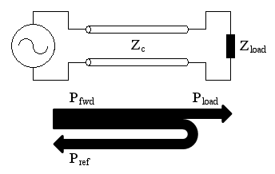
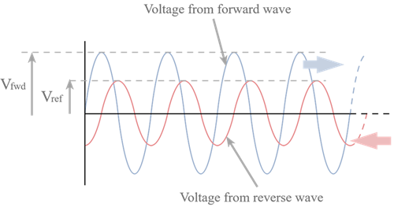

# The Impedance of an Antenna

## Antenna Impedance

As with any circuit element, the impedance of an atnenna presents to its source can be defined by the current that flows when a voltage is applied to it. There are, after all, no footnotes to Ohm's law that repeal it for the case of an antenna. Thus, for any possible connection point to an antenna, if we know the levels of current and voltage, Ohm's law will reveal the impedance at that point.

### Impedance of a Center-Fed dipole

The ratio of voltage to current, the impedance, will vary as you change any of the key dipole parameters. If you change the length through values around λ/2, the ratio will go through a point at which the ratio is resistive. This is also described as the *resonant point* - that is, there is no reactive component and thus the impedance is entirely resistive. This special length is referred to as the resonant half-wave dipole length. It is frequently used and encountered.

### Impedance of a Dipole in Free Space

We will begin by considering a thin dipole in free-space. At resonance it will have an impedance around 72 ohms. If you make the antenna slightly shorter (or a slightly lower frequency), it will look like a resistance in series with a small amount of capacitance. If you make it longer (or slightly higher frequency), it will look like a resistance in series with a small inductance.

A key parameter in determining both the impedance of a resonant dipole and how the impedance changes with frequency is the ratio of length-to-diameter. As the diameter increases, the impedance/resistance will slightly go down.

The following points should be observed:
1. As the conductor diameter increases, the length of the resonant dipole decreases. Note that in free space, λ/2 at 10MHz is 49.2 feet, compared to 47.81 feet for the wire case (about 97%) down to 45.98 feet for the very thick dipole (about 93.5%)
2. As the conductor diameter increases, the change in impedance with frequency decreases. This will be important in relation to wideband antennas.
3. If the source is designed to feed a resistive load, it is relatively simple to provide a match to it even if the antenna has a reactive component. For example, if we want to operate a 10MHz Length/Diameter = 1000:1 antenna on 10.1MHz, the inductive reactance component is +11.8 Ohms. By inserting a capacitor with a capacitive reactance of -11.8 Ohms at the antenna, you will present the source with a resistive load of 74.4 Ohms, almost the same as if we shortened the antenna to make it resonant.

### Impedance of a Dipole near Earth

Reflections from the ground couple to a dipole, much in the way a load on one winding of a transformer couples to another. This the impedance of a dipole will be different at different heights above the ground, depending on the magnitude and phase of the reflection - functions of ground characteristics and height above ground.

## Review Questions

4.1: Why might we care what the impedance of an antenna is?

In order to maintain maximum power, we want our antenna to have the same or very close to the same impedance as the transmitter/wire connecting the antenna to the transmitter. If impedances are mismatched, some power will be bounced back (see diagrams below), and less power will be radiated. Impedance will both include resistive loss to heat, and reflected power. An antenna performs best when reactance is set to 0, which means it is a resonant antenna, which has the best potential power transfer and minimal reactive energy.

4.2: What principle accounts for the difference in the effect of ground between horizontal and vertical antennas?

With a vertical antenna, the ground/Earth will be a cause of resistive loss, which feeds into the impedance. This is because the current flows through the Earth as part of the return path, so current is lost to resistance as heat. With horizontal antennas, ground loss as a component of impedance will be less of a concern. In this case, the ground simply acts as a reflector, not a conductor.

4.3: What might be the effect of connecting and antenna and transmitter with different impedances?

If you connect antennas and transmitters with difference impedances, you will see more power 'bounced back' as a return wave, leading to decreased power output. Reflected waves create standing waves on the transmission line (measured as VSWR), reducing the efficiency of power transfer to the antenna.

VSWR, or Voltage Standing Wave Ratio, is how you measure impedance mismatch in an RF system. VSWR tells you how much of your signal is being reflected back instead of delivered to the antenna. 

| VSWR | Meaning           |
| ---- | ----------------- |
| 1:1  | perfect match     |
| 2:1  | small mismatch    |
| 3:1  | moderate mismatch |

VSWR = Vmax/Vmin

Anything above 2:1 is a bad VSWR. 

| VSWR | Reflected Power |
| ---- | --------------- |
| 1:1  | 0%              |
| 2:1  | ~11%            |
| 3:1  | ~25%            |
| 5:1  | ~44%            |

Higher VSWR may also result in overheating/damage in addition to reduced power and range.

We can do the below to calculate VSWR from impedances:

In this example, our transmission line will have impedance Z0 of 50 Ohms. Our load (antenna) will have ZL.

You can calculate the reflection coefficient (Γ): Γ = (ZL-Z0)/(ZL+Z0) where 0 is a perfect match, and |Γ| = 1 is total reflection.

In this case, we can say Z0 is 50 Ohms, and ZL is 25 Ohms. So, we can evaluate it as: (25-50)/(25+50) = -25/75 = -0.33 -> |Γ| -> 0.33 is the reflection coefficient.

Now, we can convert that to VSWR by doing the following: VSWR = (1 + |Γ|)/(1-|Γ|)

In this case, that means (1+0.33)/(1-0.33) = 1.33/0.67 ~= 2:1.

Therefore, from looking at the above, we can see that a mismatch of impedances results in decreased power and range, with an increase in power reflected back and higher heat generated.

4.4: Describe advantages and disadvantages of thin and thick antennas as shown in figures 4-3 through 4.5.

As the antenna becomes thicker, the reactance becomes more tightly grouped around 0 Ohms, resulting in an increased bandwidth and easier impedance matching. 

Thin antennas are simpler and lighter but have a narrower bandwidth and require more precise tuning. Thick antennas provide a wider bandwidth and more stable impedance characteristics but are larger, heavier, and more difficult to construct.

### Notes trying to figure out questions above

Impedance via inductive reactance is caused by the swapping of directions in an AC circuit. The 'stored energy' opposes change, resulting in increased impedance. This is why higher frequency will have a higher inductive reactance, as the signal is changing more frequently causing more impedance.

Impedance via capacitive reactance is the opposition to AC current caused by a capacitor's charging behavior, which decreases as frequency increases (faster voltage change -> higher current means higher frequency is less impacted). Some cases where this is useful is high-pass filtering, where it blocks low frequencies and passes RF signals, or matching networks where it cancels inductive reactance and can be used to tune antennas.

Impedance is returned power to the source. A visual is here:

