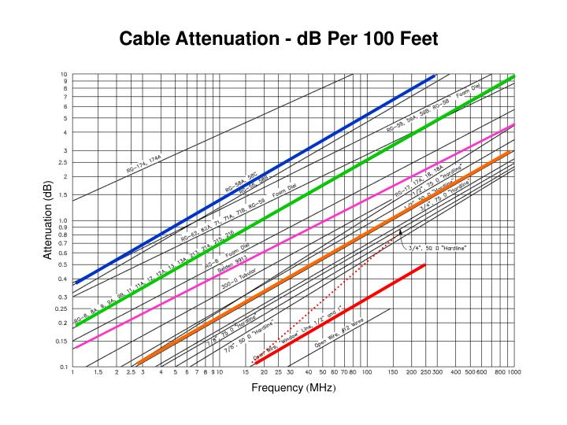

# Transmission Lines

In most cases, optimum performance requires the transmitter and receiver to be at some distance from the antenna (minus handheld systems and systems like radar). In situations like combat, it may even be a matter of survival to maintain distance from the antenna due to adversarial anti-RF weaponry.

The component connecting the antenna and the transmitter is called a *transmission line*. Transmission lines are used in places besides radio systems, such as power distribution lines, telephone lines, and cable TV connections. In additional to transporting signals, transmission lines have other important properties to understand to properly use them.

## Characteristic Impedance

A transmission line generally is composed of two conductors, either parallel wires (such as power lines), or one wire surrounding the other (such as with coaxial wire). Either type has a certain inductance and capacitance per unit length and can be modeled with the values determined by the physical dimensions of the conductors and the properties of the insulating material between the conductors.

If voltage or signal is applied to such a network, there will be an initial current flow independent of what is on the far end of the line, but based only on the L (length) and C (circumference) values. The initial current will be the result of the source charging the shunt capacitors through the series inductors and will be the same as if the source were connected to a resistor whose value is equal to the square root of L/C. If the far end of the line is terminated in a resistive load of the same value, all the power sent down the line will be delivered to the load. This is called a *matched condition*. The impedance determined in this way is called the *characteristic impedance* of the transmission line and is perhaps the most important parameter associated with a transmission line. 

Common coax lines have characteristic impedances (referred to as Z0) between 35 and 100 Ohms, while balanced lines (parallel) are found in the range of 70 to 600 Ohms. This means that if we have an antenna with an impedance of 50 Ohms and a radio transmitter designed to drive a 50 Ohm load, we can connect the two with any length of the appropriate 50 Ohm coax cable and the transmitter will think it is right next to the antenna. The antenna will receive *most* of the transmitted power.

## Attenuation

A real transmission line has loss resistance associated with the wire conductors and loses some signal due to the lossy nature of the insulating material. As transmission lines are made of larger conductors, the resistance is reduced and as the dielectric material gets closer to low-loss air, the losses are reduced. The *skin effect* causes currents to travel nearer to the surface of the conductors at higher frequencies, and the effective loss thus increases as the frequency increases.

In the above diagram we can see real-world examples of the losses as a function of frequency for the most common types of transmission line. Note that the loss increases linearly with length and the values are for a length of 100 feet. Note that the losses are shown for transmission lines with feeding loads matched to their Z0 (characteristic impedance). Losses can increase significantly if not matched.

The open wire line shows consists of two parallel wires with air dielectric and spacers, typically resulting in a Z0 of 600 Ohms. While the losses of such a line are low, they only work well if spaced from metal objects and not coiled up. While coax cables have higher loss, almost the entire signal is kept within the outer conductor. Coax can run inside conduit, coiled up, placed adjacent to other wires, and is therefore more convenient to work with. Sometimes a long straight run of open wire line will be transformed to 50 Ohms at the ends with coax cable used at the antenna and radio ends to take advantage of the benefits of both.

## Propagation Velocity

