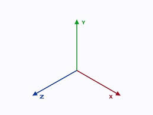

# Chapter 1: Two Birds with One Tone: I/Q Signals and Fourier Transform

## Part I: I/Q Signals

### 1.1 An Electromagnetic Messenger

#### 1.1.1 The Sinusoidal Wave

An electromagnetic wave produced by an oscillator through acceleration and deceleration of charges in the forward and reverse directions (which just oscillate back and forth) yields a wave that follows a sinusoidal form.

The opposite happens on the receiving side. The incoming EM wave influences the electrons in the antenna via the electric and magnetic fields, accelerating and decelerating the electrons creating a tiny sinusoidal electrical signal.

In signal processing, a pure sinusoidal signal is also known as a **tone**. 

#### 1.1.2 The Message

The sinusoidal wave can be written as the following:

x(t) = *A*cos(wt + o) where
- *A* is the amplitude
- w is the angular frequency
- o is the phase shift

**Phase Shift**: This occurs when the waveform is displaced to the right or left from the zero time reference (not aligned with how the waveform is defined, e.g. with peak of a cosine or zero of sine).

**Phase Angle**: This is the angle of a complex number in the plane formed by real and imaginary parts. A good example of phase angle is the carrier phase offset between the Tx and Rx local oscillators.

Any of the above 3 parameters of a sinusoid can be changed with time to encode a message. The information in this message can be user generated (wireless comms), coming from the laws of nature (radar, astronomy, etc), or both (GPS, beamforming).

#### 1.1.3 Are There More Carriers?

A question is how to get more carriers on a sinusoidal wave to deliver more messages. To achieve this, there should be no interference among carriers as a fundamental requirement. However, when two carriers with different amplitudes (or phase shift of frequency) combiine, they create a wave with an amplitude (or phase shift or frequency) that differs from both the origin carriers. They cannot coexist without meddling with eachother. The solution lies in orthogonality.

### A Numerical Prism

In mathematics, orthogonality is a concept that generalizes the geometric idea of perpendicularity to linear algebra.

#### 1.2.1 Orthogonality

To understand why orthogonality is important, consider an example in 3D space where the vectors x, y, and z are all 90* to eachother.

Any point in this 3D space can be written as a combination of the *basis vectors* with x, y, and z coordinates (think minecraft coordinates).

r = xi + yi + zk

where i, j, and k are the unit vectors in those dimensions. No matter how far we travel in x direction, there is absolutely no change in y and z coordinates. This is orthogonality.

